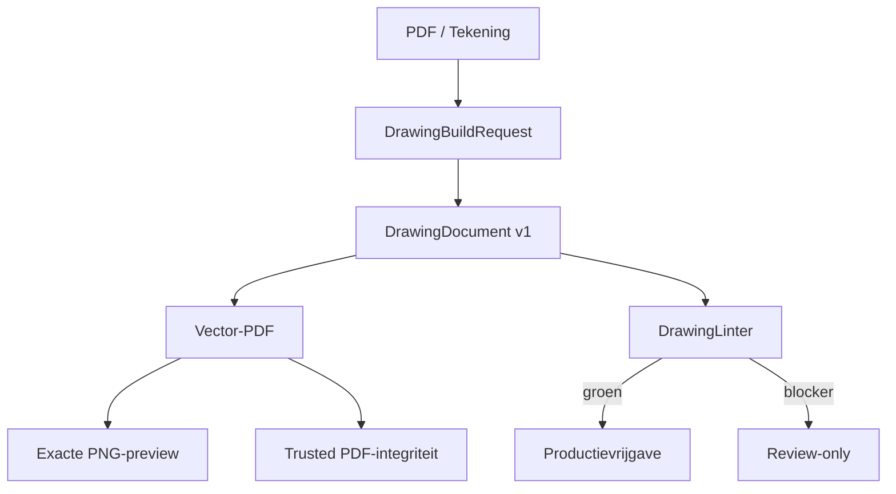

# PDF / Tekening — geïntegreerde one-build close-out

Datum: 2026-09-02

Branch: `agent/cws-product-ui-reintegration-v1`

Basis-HEAD: `a2cd946d1c2eef9ea454c2feebd4770f87600576`

## Besluit

De actieve `PDF / Tekening`-werkruimte gebruikt één versieerbare
`DrawingDocument`-autoriteit voor preview, vector-PDF, printregistratie en
Trusted PDF. De PNG-preview wordt uit de definitieve PDF gerasterd en bouwt de
tekening niet opnieuw op. Trusted PDF voegt het canonieke model en manifest toe
aan precies dezelfde zichtbare pagina's.

Productievrijgave is fail-closed. Een review-PDF blijft mogelijk, maar de
DrawingLinter geeft alleen `release_ready=true` wanneer actuele canonical
rebuild, BREP-geometrie, OCCT-HLR, exacte BREP-doorsnede, DimensionGraph,
manufacturinghash, vier-formaat-roundtrip, titelblok en volledige feature- en
maatdekking bewezen zijn.

## Architectuur

## Gapmatrix na bronimplementatie

Legenda:

- `SOURCE_PASS`: geïmplementeerd en door lokale bronproeven afgedekt.
- `NATIVE_GATE`: geïmplementeerd; definitief bewijs vereist de CadQuery/OCCT
  Windows-runtime.
- `REVIEW_ONLY`: functie beschikbaar voor review, maar productie blijft bewust
  geblokkeerd zolang exacte bronbewijzen ontbreken.
- `CI_PENDING`: exacte commit moet nog door source-, GUI-, packaged- en
  portable-gates.

| ID | Functie | Status na deze build | Autoriteit / bewijs |
|---|---|---|---|
| PDF-01 | PDF genereren | SOURCE_PASS | `ProductionDrawingRenderer` + `DocumentOutputService` |
| PDF-02 | A0–A4 | SOURCE_PASS | fysieke ISO-bladmaten, beide oriëntaties getest |
| PDF-03 | Portrait/landscape | SOURCE_PASS | UI-keuze en documentveld |
| PDF-04 | Auto/vaste schaal | SOURCE_PASS | standaardreeks en clipping-safe opschaling |
| PDF-05 | mm/cm | SOURCE_PASS | zichtbare maatwaarden worden werkelijk omgerekend |
| PDF-06 | Voor/boven/zij | SOURCE_PASS | gedeelde projectieautoriteit |
| PDF-07 | 3D versus ISO | SOURCE_PASS | afzonderlijke projectierichtingen en regressieproef |
| PDF-08 | Preview = PDF | SOURCE_PASS | preview is rasterisatie van definitieve PDF |
| PDF-09 | Hoofdmaten | SOURCE_PASS | zichtbare maatlaag + DimensionGraph-schema |
| PDF-10 | Contour + gaten | SOURCE_PASS | gefilterde documentweergave, fail-closed voor release |
| PDF-11 | Productiematen | SOURCE_PASS | volledige kritische maatset vereist voor release |
| PDF-12 | Eigen maten | SOURCE_PASS | feature-/randgebonden handmatige maatobjecten |
| PDF-13 | Gatcallouts | SOURCE_PASS | diameter, positie en hartlijnen gekoppeld aan feature-ID |
| PDF-14 | Sleufgaten | SOURCE_PASS | sleufgeometrie en maatcallout |
| PDF-15 | Verzonken gaten | SOURCE_PASS | binnen-/buitendiametercallout |
| PDF-16 | Pockets/copes/cutouts | SOURCE_PASS | gekoppelde contour en annotatie |
| PDF-17 | Verstek/kopse sneden | SOURCE_PASS | hoekcallout uit productiedata |
| PDF-18 | Scribing/markering | SOURCE_PASS | afzonderlijke annotatielaag en featurebinding |
| PDF-19 | Echte HLR | NATIVE_GATE | OCCT `HLRBRep_Algo`; meshfallback kan niet vrijgeven |
| PDF-20 | Verborgen lijnen | NATIVE_GATE | afzonderlijke gestippelde hidden-laag |
| PDF-21 | Triangulatielijnen | SOURCE_PASS | coplanaire meshdiagonalen onderdrukt; exacte route gebruikt BREP |
| PDF-22 | Centerlines | SOURCE_PASS | afzonderlijke centerline-laag |
| PDF-23 | Doorsneden | NATIVE_GATE | echte OCCT BREP-vlakdoorsnede met begrensde arcering |
| PDF-24 | Detailviews | SOURCE_PASS | per feature een gekoppeld vergroot detail, met vervolgbladen |
| PDF-25 | Exact eindaanzicht | NATIVE_GATE | BREP-vlakdoorsnede in plaats van headerschets |
| PDF-26 | Exact 3D/ISO | NATIVE_GATE | OCCT-HLR op canonical rebuilt BREP |
| PDF-27 | Titelblok | SOURCE_PASS | op ieder blad uit hetzelfde document |
| PDF-28 | Revisie/status/blad | SOURCE_PASS | titelblok en revisietabel met totaal bladaantal |
| PDF-29 | BOM/materiaaltabel | SOURCE_PASS | onderdeel- en assemblyregels met vervolgbladen |
| PDF-30 | Algemene notities | SOURCE_PASS | documentdata, automatisch vervolgd |
| PDF-31 | Meerdere bladen | SOURCE_PASS | details, maten, BOM en revisies pagineren automatisch |
| PDF-32 | Assembly drawing | REVIEW_ONLY | selecteerbaar, assembly-BOM/fasteners/welds; productie blokkeert zonder exact assemblybewijs |
| PDF-33 | DimensionGraph | SOURCE_PASS | canonieke dimensies en ketens zijn documentinput |
| PDF-34 | DrawingLinter | SOURCE_PASS | centrale fail-closed autoriteit |
| PDF-35 | Clipping/collision | SOURCE_PASS | clipping-, overlap- en dekkingsproeven |
| PDF-36 | 800% vector | SOURCE_PASS | zichtbare pagina bestaat uit ReportLab-vectorprimitieven |
| PDF-37 | Trusted model/hash | SOURCE_PASS | canonical model, manifest, DrawingDocument en zichtbare hash |
| PDF-38 | Trusted zichtinhoud | SOURCE_PASS | Trusted wrapper gebruikt dezelfde DrawingDocument-render |
| PDF-39 | Zichtbare roundtrip | SOURCE_PASS | zichtbare contenthash plus embedded documentcontrole |
| PDF-40 | Externe PDF lezen | REVIEW_ONLY | analyse blijft confidence-/vraaggestuurd; geen geometriegokken |
| PDF-41 | Print Center | SOURCE_PASS | geregistreerde definitieve PDF blijft printautoriteit |
| PDF-42 | Workbench → PDF | SOURCE_PASS | manufacturingwijziging maakt drawing state direct stale |
| PDF-43 | Exact-SHA release proof | CI_PENDING | pas groen na Windows source/package/portable-bewijs |

## Verificatiecontract

`tests/production_drawing_engine_smoke.py` bewijst lokaal onder meer:

1. één versioned document voor alle zichtbare en semantische inhoud;
2. A0–A4 portrait/landscape met fysieke bladmaten;
3. verschillende ISO- en 3D-projecties;
4. onderdrukking van coplanaire triangulatiediagonalen;
5. volledige feature- en maatdekking en automatische vervolgbladen;
6. identieke PDF-, preview- en embedded-documenthashes;
7. weigering van documenttamper, clipping en annotatiebotsingen;
8. fail-closed gedrag bij meshfallback of ontbrekende revisiebewijzen;
9. op Windows: native OCCT-HLR, BREP-section en Trusted PDF in één test.

De definitieve status van `NATIVE_GATE` en `CI_PENDING` wordt niet uit
broninspectie afgeleid: uitsluitend de workflow op de gepubliceerde exacte
commit mag deze statussen sluiten.
