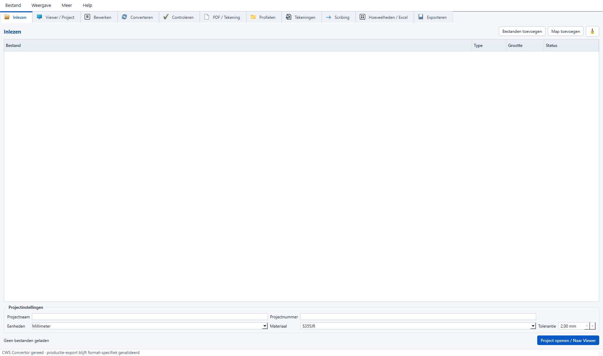

# CWS Convertor V9 UI-refactor audit

Datum: 2026-08-14
Doel: de bestaande applicatie ordenen volgens de aangeleverde elf werkruimtes, met Viewer / Project als centrale cockpit.

## Uitgangspunt

- De bestaande project-, conversie-, geometrie-, validatie-, PDF/AI- en exportlogica blijft eigenaar van haar gedrag.
- V9 is componentgewijs geintegreerd; het nieuwere CWS-projectschema 2.5 en de bestaande Part Workbench zijn niet door de oudere V9-snapshot vervangen.
- Een selectie uit modeltree, 3D-viewer of property grid gebruikt dezelfde canonieke entity-ID en wordt doorgegeven aan aangesloten werkruimtes.
- Niet-bestaande productielogica wordt niet gesimuleerd. Zo'n punt is zichtbaar als `UI integration gap`.

## Werkruimtes

| Nr. | Nieuwe werkruimte | Bestaande functie / aansluiting |
|---:|---|---|
| 1 | Inlezen | Bestand/mappen toevoegen; `.cwscproj` opent Project, modelbestanden gaan naar Converteren en PDF naar PDF / Tekening. |
| 2 | Viewer / Project | V9 projecttree, VTK-weergave, property grid, selectie, display-tools, metingen, secties en revision compare. |
| 3 | Bewerken | Actieve selectie en bestaande Exact Part Workbench. |
| 4 | Converteren | Bestaande converterqueue en projectselectie. |
| 5 | Controleren | Bestaande validatie, revisievergelijking en het gedocumenteerde optimalisatiegat. |
| 6 | PDF / Tekening | Bestaande PDF/AI-review, Trusted PDF en koppeling aan actieve selectie. |
| 7 | Profielen | Bestaande profieldatabase als zoekbare werkruimte; geavanceerd beheer blijft bereikbaar via de compatibiliteits-UI. |
| 8 | Tekeningen | Contextgestuurde toegang tot PDF / Tekening en Part Workbench. |
| 9 | Scribing | Contextgestuurde toegang tot bestaande scribing in Part Workbench. |
| 10 | Hoeveelheden / Excel | Bestaande BOM- en Excelrapportage uit het actieve project. |
| 11 | Exporteren | Bestaande strikte productie-export met release gate en selectiecontext. |

## Viewer-acties

Dezelfde actieroutes zijn beschikbaar via `Acties`, het contextmenu van de modeltree, het contextmenu van de 3D-viewer en het contextmenu van de property grid:

`properties`, `viewer`, `edit`, `convert`, `validate`, `pdf`, `profiles`, `drawings`, `scribing`, `quantities`, `export`.

Visuele Viewer-acties zoals isoleren, verbergen, ghosten en passend zoomen blijven binnen de viewer. Productie-export blijft eigendom van de bestaande `ProjectSession`-release gate.

## PDF-tekening

De standaard onderdeeltekening is A3 liggend en bevat:

- elevatie, boven- en onderflensplan, profieldoorsnede, gatdetail en schematische 3D-review;
- materiaal/profiel, stuklijst, gaten, uitsparingen/snedes en algemene notities;
- horizontale incrementele plus absolute maatvoering;
- verticale absolute maatvoering;
- identificatie en maatvoering van ieder gat;
- Tasche Staalbouw-logo en titelblok.

Deze wijziging betreft alleen presentatie en tekenlayout. De Trusted PDF-integriteit, canonieke bronwaarden en releaseblokkades blijven actief.

## Bekende UI integration gaps

- Er is geen bestaande optimalisatiesolver/API in deze repository. De werkruimte `Controleren > Optimalisatie` benoemt dit expliciet en voert geen verzonnen berekening uit.
- Bewerken, Tekeningen en Scribing openen de bestaande Part Workbench. Er is bewust geen tweede geometry-editor in de hoofdschil gebouwd.
- Profielbeheer met schrijfacties blijft voorlopig in de bestaande compatibiliteits-UI; de V9-hoofdschil biedt de betrouwbare lees- en selectieflow.

## Regressiecontract

- `tests/viewer_v9_workspace_navigation_smoke.py` bewaakt werkruimtenamen en actieroutes.
- `tests/viewer_v9_integration_smoke.py` bewaakt gedeelde projectinstantie en selectie-identiteit.
- `tests/part_drawing_standard_smoke.py` bewaakt A3, vaste maatvoeringsregels, alle vereiste aanzichten/tabellen en het Tasche-logo.
- De bestaande conversie-, viewer-, PDF-, project- en release-smokes blijven onderdeel van de volledige V9-smokerun.

## Gevalideerde oplevering

- Volledige bronmatrix: 114 scripts geslaagd, 2 optionele externe referentieprojecttests overgeslagen, 0 fouten, 0 timeouts.
- Native Tk/OCCT Exact Part-test: geslaagd met bron- en canonical BREP.
- V9 Windows GUI-projectsmoke: geslaagd met gedeelde projectidentiteit voor scene, grid en BOM.
- Windows dist, verse portable extractie en stille installatie: alle native, GUI-, CLI-, project- en conversiechecks geslaagd zonder externe Python op het child-PATH.
- Installer SHA-256: `115a5d150ac3f6e142247677ae92ddcf326fe94de7da3aa355f201dff452555e`.
- Portable SHA-256: `e2c8375c2be963a2dc5494cf092268c2ecf28bc6755d3b8c7d2b758294e0c7f2`.

De twee overgeslagen tests vereisen het niet-openbare volledige referentieproject met 6.162 canonieke entiteiten. Zij zijn niet als geslaagd geboekt; zodra `CWS_V8_REFERENCE_PROJECT` en `CWS_V9_REFERENCE_PROJECT` naar dat model wijzen, worden zij automatisch uitgevoerd.
